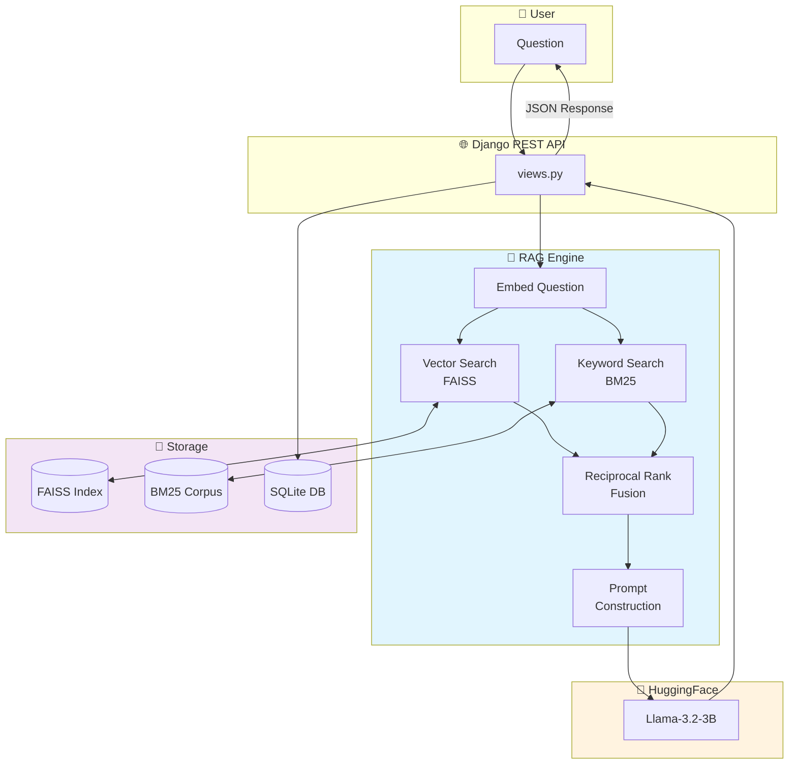
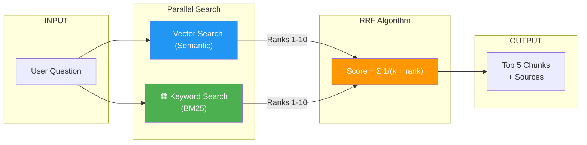

# 🤖 Knowledge Assistant API

> An intelligent RAG (Retrieval-Augmented Generation) system that answers questions from a specialized knowledge base using Hybrid Search and LLM reasoning.

[](https://python.org)
[](https://djangoproject.com)
[](LICENSE)

---

## 📌 Table of Contents

- [Overview](#-overview)
- [Key Features](#-key-features)
- [Tech Stack](#-tech-stack)
- [System Architecture](#-system-architecture)
- [Project Structure](#-project-structure)
- [Installation](#-installation)
- [API Reference](#-api-reference)
- [Sample Outputs](#-sample-outputs)
- [How It Works](#-how-it-works)

---

## � Overview

This project is a **production-ready backend API** that transforms static PDF documents into an intelligent Q&A system. Built for the Science Class IX NCERT curriculum, it can:

- Parse and index **14 PDF chapters** (Physics, Chemistry, Biology)
- Answer natural language questions with **cited sources**
- Use **Hybrid Search** (Semantic + Keyword) for maximum retrieval accuracy
- Minimize hallucinations through **context-grounded responses**

---

## ✨ Key Features

| Feature | Description |
|---------|-------------|
| 🔍 **Hybrid Search** | Combines Vector Search (FAISS) + Keyword Search (BM25) using RRF |
| 🧠 **LLM Reasoning** | Powered by Meta's Llama-3.2-3B-Instruct via HuggingFace |
| 📄 **Source Citations** | Every answer includes page-level references |
| 📊 **Interaction Logging** | All Q&A pairs stored for analytics/audit |
| ⚡ **Fast Retrieval** | Sub-second search across 494 text chunks |
| 🛡️ **Hallucination Control** | Strict prompting ensures factual responses |

---

## 🛠️ Tech Stack

| Layer | Technology | Purpose |
|-------|------------|---------|
| **Backend** | Django 6.0 + DRF | REST API, ORM, Admin Panel |
| **Vector DB** | FAISS (IndexFlatL2) | Semantic similarity search |
| **Keyword Search** | Rank-BM25 | TF-IDF based retrieval |
| **Embeddings** | Sentence-Transformers | all-MiniLM-L6-v2 (384-dim) |
| **LLM** | HuggingFace Inference API | Llama-3.2-3B-Instruct |
| **PDF Parser** | PyPDF2 | Text extraction with metadata |
| **Database** | SQLite | Document & interaction tracking |

---

## 🏗️ System Architecture

### High-Level Flow



### Hybrid Search with RRF



---

## 📁 Project Structure

```
LLM-Powered Knowledge Assistant API/
│
├── config/                         # Django project settings
│   ├── settings.py                 # Configuration (DB, APIs, Paths)
│   ├── urls.py                     # Root URL routing
│   └── wsgi.py                     # WSGI entry point
│
├── assistant/                      # Main application
│   ├── models.py                   # KnowledgeDocument, InteractionLog
│   ├── views.py                    # AskQuestionView API
│   ├── urls.py                     # /api/ask-question/ endpoint
│   ├── services/
│   │   ├── ingestion.py            # PDF parsing, chunking, indexing
│   │   └── rag_service.py          # Hybrid search + LLM integration
│   └── management/commands/
│       └── ingest_kb.py            # CLI: python manage.py ingest_kb
│
├── data/
│   ├── knowledge_base/             # Source PDFs (14 files)
│   └── faiss_index/                # Generated indices
│       ├── index.faiss             # Vector embeddings
│       ├── bm25_corpus.pkl         # Tokenized corpus
│       └── chunks.txt              # Raw text chunks
│
├── .env                            # Environment variables
├── requirements.txt                # Python dependencies
├── manage.py                       # Django CLI
└── README.md                       # This file
```

---

## 🚀 Installation

### Prerequisites

- Python 3.10+
- HuggingFace API Token ([Get one here](https://huggingface.co/settings/tokens))

### Step-by-Step Setup

```bash
# 1. Navigate to project directory
cd "LLM-Powered Knowledge Assistant API"

# 2. Create virtual environment
python3 -m venv venv
source venv/bin/activate  # Linux/Mac
# OR: venv\Scripts\activate  # Windows

# 3. Install dependencies
pip install -r requirements.txt

# 4. Configure environment
cp .env.example .env
# Edit .env and add your HUGGINGFACE_API_KEY

# 5. Run migrations
python manage.py migrate

# 6. Ingest knowledge base (one-time)
python manage.py ingest_kb

# 7. Start server
python manage.py runserver
```

---

## � API Reference

### Ask Question

**Endpoint:** `POST /api/ask-question/`

**Request:**

```bash
curl -X POST http://localhost:8000/api/ask-question/ \
     -H "Content-Type: application/json" \
     -d '{"question": "What is the powerhouse of the cell?"}'
```

**Response:**

```json
{
  "answer": "Mitochondria are the powerhouse of the cell as they generate ATP (Adenosine triphosphate) molecules.",
  "sources": ["iesc105.pdf - Page 9"]
}
```

| Field | Type | Description |
|-------|------|-------------|
| `question` | string | Natural language question |
| `answer` | string | LLM-generated answer grounded in context |
| `sources` | array | List of "filename - Page X" citations |

---

## 📝 Sample Outputs

| # | Question | Answer | Sources |
|---|----------|--------|---------|
| 1 | What is the fundamental unit of life? | The cell | iesc105.pdf - Page 9 |
| 2 | Define evaporation | Change of liquid to vapour below boiling point | iesc101.pdf - Page 9 |
| 3 | Function of Golgi apparatus? | Storage, modification, packaging of products | iesc105.pdf - Page 8 |
| 4 | Three states of matter? | Solid, Liquid, Gas | iesc102.pdf - Page 5 |
| 5 | Powerhouse of the cell? | Mitochondria (generates ATP) | iesc105.pdf - Page 9 |
| 6 | Prokaryotic vs Eukaryotic? | Prokaryotes lack nuclear membrane | iesc105.pdf - Page 10 |
| 7 | What is osmosis? | Net diffusion of water across membrane | iesc105.pdf - Page 3 |
| 8 | Who discovered nucleus? | Robert Brown in 1831 | iesc105.pdf - Page 5 |
| 9 | Role of ribosomes? | Protein manufacture | iesc106.pdf - Page 12 |
| 10 | Constituents of nucleus? | Protons and neutrons | iesc102.pdf - Page 8 |

---

## 🔬 How It Works

### 1️⃣ Ingestion Pipeline

```
PDFs → PyPDF2 → Raw Text → Chunking (1000 chars, 200 overlap)
    → Sentence-Transformers → FAISS Index
    → Tokenization → BM25 Corpus
```

### 2️⃣ Query Pipeline

```
Question → Embed → FAISS Search (Semantic)
                → BM25 Search (Keyword)
                → RRF Fusion → Top 5 Chunks
                → Prompt + Context → Llama-3.2
                → Answer + Sources
```

### 3️⃣ Hallucination Prevention

- **Strict System Prompt**: "Only use provided context"
- **Low Temperature (0.1)**: Deterministic, factual responses
- **Source Tracking**: Verifiable citations
- **Bounded Context**: Only top 5 relevant chunks passed

---

## 📜 License

This project was created as part of a technical assessment.

---

<p align="center">
  Made with ❤️ using Django, FAISS, and HuggingFace
</p>
